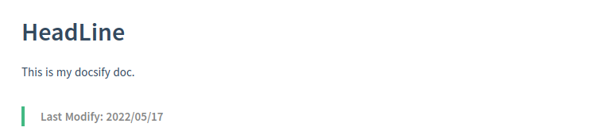

### ● 高亮警报  
  [ docsify plugin: Flexible Alerts@fzankl](https://github.com/fzankl/docsify-plugin-flexible-alerts)
  

  测试：
  一点
  

 **使用方法：**  
#### 1、html 中加载 js 插件  <!-- {docsify-ignore} --> 
  ```html
  <script src="https://unpkg.com/docsify-plugin-flexible-alerts"></script>
  ```
#### 2、配置样式  <!-- {docsify-ignore} --> 
  默认样式是 `callout` (图左)，如需更换图右 `flat` 样式，可如下修改全局默认样式：
  ```html
  <script>
    window.$docsify = {
      'flexible-alerts': {
        style: 'flat'
      }
    };
  </script>
  ```
#### 3、输入格式  <!-- {docsify-ignore} --> 
  ```markdown
  > [!note]
  > （填写你要的内容）

  > [!tip]
  > （填写你要的内容）

  > [!warning]
  > （填写你要的内容）

  > [!attention]
  > （填写你要的内容）
  ```

  显示效果如下：  
    

  上图全局默认 style 是 `callout`；也可单独指定：  
  ```markdown
  > [!tip|style:flat]
  > （填写你要的内容）
  ```

  效果如下：
  .png ":no-zoom")
#### 4、自定义  <!-- {docsify-ignore} --> 
  插件共有 6 种属性可供自定义

  |属性|值|
  |:----:|:----:|
  |style|callout，flat|
  |label|(任意内容)|
  |icon|FontAwesome 图标，例如 'fas fa-comment'，需布置css和fonts|
  |className|CSS 类的名称，指定外观|
  |labelVisibility|visible(默认)，hidden|
  |iconVisibility|visible(默认)，hidden|

  例如：
  ```markdown
  > [!tip|style:flat|label:个人设定|iconVisibility:hidden]
  > 指定样式为 <font color=#ff7038>"flat"</font>，标题修改为 <font color=#ff7038>“个人设定”</font>；<br/>
  > 隐藏图标 <font color=#ff7038>"iconVisibility:hidden"</font>；<br/>
  > 当然也可以隐藏标题 <font color=#ff7038>"labelVisibility:hidden"</font>，**甚至两个都隐藏。**
  ```
  效果如下：
  .png ":no-zoom")

  也可以在全局中设定：
  ```html
  <script>
    window.$docsify = {
      'flexible-alerts': {
        style: 'flat',
        note: {
          label: "备注"
        },
        tip: {
          label: "提示"
        },
        warning: {
          label: "警告"
        },
        attention: {
          label: "注意"
        }
      }
    };
  </script>
  ```
  - - -

### ● Gif 播放控制  
  [ docsify-gifcontrol@gbodigital](https://github.com/gbodigital/docsify-gifcontrol)  
  > **鼠标悬停播放效果：(默认)**  
    

  > **鼠标点击播放效果：("-gifcontrol-mode=click;")**
   
  
 **使用方法：**
#### 1、html 中引入 css／js 文件  <!-- {docsify-ignore} --> 
  ```html
  <link rel="stylesheet" href="//unpkg.com/docsify-gifcontrol/dist/docsify-gifcontrol.css">
  ```
  ```html
  <script src="//unpkg.com/docsify-gifcontrol/dist/docsify-gifcontrol.js"></script>
  ```
#### 2、markdown 中加入 Gif 即可  <!-- {docsify-ignore} --> 
  默认悬停播放
  ```markdown
  
  ```
  点击播放
  ```markdown
  
  ```
  个性化图标
  ```markdown
  ; -gifcontrol-playIcon=<svg xmlns=\"http://www.w3.org/2000/svg\" viewBox=\"0 0 512 512\"><path d=\"M462.3 62.6C407.5 15.9 326 24.3 275.7 76.2L256 96.5l-19.7-20.3C186.1 24.3 104.5 15.9 49.7 62.6c-62.8 53.6-66.1 149.8-9.9 207.9l193.5 199.8c12.5 12.9 32.8 12.9 45.3 0l193.5-199.8c56.3-58.1 53-154.3-9.8-207.9z\"/></svg>;")
  ```
  自动播放
  ```markdown
  
  ```
- - -

### ● 右侧代码面板  
  [ docsify-example-panels@VagnerDomingues](https://github.com/VagnerDomingues/docsify-example-panels)  
  > 展示图<br/>
  

 **使用方法**
- - -

### ● fontawesome 字体图标  
  [ docsify-fontawesome@erickjx](https://github.com/erickjx/docsify-fontawesome)  
  Docsify 的 FontAwesome 字体图标插件。
 
 **使用方法**
#### 1、将 FontAwesome CSS 插入 index.html <!-- {docsify-ignore} --> 
  ```html
  <link rel="stylesheet" href="//unpkg.com/@fortawesome/fontawesome-free/css/fontawesome.css" />
  <link rel="stylesheet" href="//unpkg.com/@fortawesome/fontawesome-free/css/brands.css" />
  <link rel="stylesheet" href="//unpkg.com/@fortawesome/fontawesome-free/css/regular.css" />
  <link rel="stylesheet" href="//unpkg.com/@fortawesome/fontawesome-free/css/solid.css" />
  ```
#### 2、将脚本插件插入到同一文档中 <!-- {docsify-ignore} --> 
  ```html
  <script src="//unpkg.com/docsify-fontawesome/dist/docsify-fontawesome.min.js"></script>
  ```
#### 3、使用格式 <!-- {docsify-ignore} --> 
  两个`:`字符内的任何文本都会被处理为 CSS 样式并转换为 FontAwesome 的 HTML 代码，例如：
  > **&colon;fa-regular fa-folder fa-xl:** 自动转换为 html 代码：`<i class="ffa-regular fa-folder fa-xl"></i>`
  **显示效果为：**  
  > **&colon;fa-regular fa-folder fa-xl:** 自动转换为 html 代码：<i class="fa-regular fa-folder fa-xl"></i>
- - -

### ● 文档添加更新时间
  [ docsify-updated@pfeak](https://github.com/pfeak/docsify-updated)  
  为每个 docsify markdown 文档增加更新时间。  
  示例图片：
  > 

  > 

  > 

 **使用方法**
#### 1、添加 js CDN 到 index.html <!-- {docsify-ignore} --> 
  ```markdown
  <script src="https://cdn.jsdelivr.net/npm/docsify-updated/src/time-updater.min.js"></script>
  ```
  或者
  ```markdown
  <script src="https://cdn.jsdelivr.net/npm/docsify-updated/src/time-updater.js"></script>
  ```
#### 2、添加配置 <!-- {docsify-ignore} --> 
  可以根据规则修改参数内容。  
  ```html
  window.$docsify = {
    timeUpdater: {
      text: ">last update time: \{docsify-updated\}",  //需要把反斜杠 “\” 删除
      formatUpdated: "{YYYY}/{MM}/{DD}",
      whereToPlace: "bottom",  // "top" or "bottom", default to "bottom"
    },
  };
  ```
  或者
  ```html
  window.$docsify = {
    timeUpdater: {
      text: ">最后更新时间: \{docsify-updated\}",  //需要把反斜杠 “\” 删除
      formatUpdated: "{YYYY}/{MM}/{DD}",
      whereToPlace: "bottom",  // "top" or "bottom", default to "bottom"
    },
  };
  ```  
  插件参数  

  |参数|描述|详情|
  |:-:|:-:|:-:|
  |text|将要展示标签的样式|text 存放并渲染 formatUpdated 之前的内容|
  |formatUpdated|更新时间的格式，与之后的内容|formatUpdated 指定时间格式，与该标签之后的内容，eg. {YYYY}/{MM}/{DD} by 作者名|
  |whereToPlace|插件摆放位置|"top" 或 "bottom", 默认 "bottom"|  
  时间格式
  - {YYYY}: 年; eg: 2017
  - {YY}: （缩略）年; eg: 17
  - {MM}: 月; eg: 04
  - {DD}: 日; eg: 01
  - {HH}: 小时; eg: 06 (24h)
  - {mm}: 分; eg: 59
  - {ss}: 秒; eg: 09
  - {fff}: 毫秒; eg: 555
#### 3、更多自定义配置 <!-- {docsify-ignore} --> 
  修改 timeUpdater.text 以内嵌 HTML  
  ```html
    window.$docsify = {
      timeUpdater: {
        text: "<div align='center'>last update time: \{docsify-updated\}</div>",  //需要把反斜杠 “\” 删除
        formatUpdated: "{YYYY}/{MM}/{DD}",
      },
    };
  ```  
    
  或者  
  ```html
  window.$docsify = {
    timeUpdater: {
      text: "<div align='center' width='200px' style='color:gray;font-size:10px'>-------------- 最后更新时间:&emsp;\{docsify-updated\} --------------</div>",  //需要把反斜杠 “\” 删除
      formatUpdated: "{YYYY} 年 {MM} 月 {DD} 日",
    },
  };
  ```  
    
  设置 timeUpdater.whereToPlace 来决定插件摆放的位置  
  ```html
  window.$docsify = {
    timeUpdater: {
      text: "<div align='center' width='200px' style='color:gray;font-size:10px'>-------------- 最后更新时间:&emsp;\{docsify-updated\} --------------</div>",  //需要把反斜杠 “\” 删除
      formatUpdated: "{YYYY}/{MM}/{DD}",
      whereToPlace: "top"  // "top" or "bottom", default to "bottom"
    },
  };
  ```  
    
#### 4、各种样式   <!-- {docsify-ignore} --> 
  ```html
  window.$docsify = {
    timeUpdater: {
      text: ">Last Modify: \{docsify-updated\}",  //需要把反斜杠 “\” 删除
      formatUpdated: "{YYYY}/{MM}/{DD}",
    },
  };
  ```  
    
  ```html
  window.$docsify = {
    timeUpdater: {
      text: ">Last Modify: {docsify-updated\}",  //需要把反斜杠 “\” 删除
      formatUpdated: "{YYYY}/{MM}/{DD}",
    },
  };
  ```
    
  ```html
  window.$docsify = {
    timeUpdater: {
      text: "<div align='left' width='200px' style='color:gray;font-size:16px'>Posted @ \{docsify-updated\}</div>",  //需要把反斜杠 “\” 删除
      formatUpdated: "{YYYY}-{MM}-{DD} {HH}:{mm}",
    },
  };
  ```  
    
#### 5、问题 <!-- {docsify-ignore} --> 
  1. 修改单个文档，所有文档更新时间都被修改？
    使用任何一种 CI/CD 方式过程中，如果自动拉取 git 文档部署 docsify，在这个过程中可能会遇到 .md 文件修改时间被设置为 git clone your_repo 这个 CI/CD 操作的时间，这将使插件展示文件更新的时间出现错误（插件展示的时间是各个文件最后的修改时间）。

  修复方式

    建议在部署 docsify 文档（自动或手动）期间使用 git 修复文件更新时间。

  例如手动部署文档：  
  ```
  # clone repo
  git clone https://github.com/your_repo.git

  # cd dir
  cd your_repo_dir

  # repair file update time
  git ls-files | while read file; do touch -d $(git log -1 --format="@%ct" "$file") "$file"; done

  # Start the docsify service
  docsify serve docs/
  ```